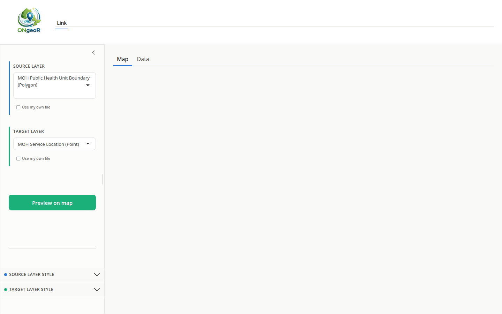

# ONgeoR

[](https://github.com/lennon-li/ONgeoR/actions/workflows/R-CMD-check.yaml)

ONgeoR is a lightweight R package for resolving Ontario locations,
facilities, and infrastructure to public-health and health-system
geography.

It helps users retrieve external source data, link locations to Public
Health Units and Ontario Health Regions, build auditable crosswalk
files, and create simple maps.

ONgeoR does not aim to be a permanent storehouse of Ontario geospatial
data. Instead, it provides reproducible workflows and source metadata so
users can retrieve, validate, link, and document data from authoritative
external sources.

## Why

Public health analysts, epidemiologists, and health-system planners in
Ontario frequently need to: - Map facilities (hospitals, long-term care
homes, schools) to Public Health Units - Link locations to Ontario
Health Regions - Build crosswalks between different geographic
boundaries - Document data sources and their provenance

ONgeoR provides a standardized, reproducible framework for these tasks
without bundling large geospatial datasets that become stale or require
constant maintenance.

## What ONgeoR Does (v0.3)

- Provides a source registry with metadata for Tier 1 Ontario GeoHub
  (LIO) datasets
- Retrieves PHU boundaries, Ontario Health Regions, municipal
  boundaries, MOH service locations, airports, waste management sites,
  conservation authorities, and ORWN railway stations at runtime, plus a
  bundled HIVE grid and a synthetic raster surface
- Links geometries by type with
  [`link()`](https://lennon-li.github.io/ONgeoR/reference/link.md)
  (point-in-polygon, polygon-to-polygon, and raster sampling) and
  [`nearest()`](https://lennon-li.github.io/ONgeoR/reference/nearest.md)
  (k-nearest and radius search), resolves records by identifier or name
  with
  [`resolve()`](https://lennon-li.github.io/ONgeoR/reference/resolve.md),
  and provides
  [`build_link()`](https://lennon-li.github.io/ONgeoR/reference/build_link.md)
  as a single no-choice entry point that picks the linking operation
  from the geometry pair
- Generates auditable crosswalk tables with full provenance metadata via
  [`build_crosswalk()`](https://lennon-li.github.io/ONgeoR/reference/build_crosswalk.md),
  including weighted apportionment;
  [`build_intersection()`](https://lennon-li.github.io/ONgeoR/reference/build_intersection.md)
  returns every overlapping polygon pair with area shares in one pass
- Draws interactive leaflet maps with
  [`map_layers()`](https://lennon-li.github.io/ONgeoR/reference/map_layers.md)
  and nearest-match maps with
  [`map_nearest()`](https://lennon-li.github.io/ONgeoR/reference/map_nearest.md)
- Ships a Shiny app launched with
  [`run_app()`](https://lennon-li.github.io/ONgeoR/reference/run_app.md)

See [ROADMAP.md](https://lennon-li.github.io/ONgeoR/ROADMAP.md) for
planned additional sources and performance work.

## What ONgeoR Does Not Do

- Bundle large geospatial datasets inside the package
- Permanently maintain or host boundary files
- Provide licensed or restricted data (e.g., PCCF postal code files)
- Replace authoritative data sources – it retrieves from them, not
  replaces them

## Design Principles

1.  **External data, not bundled** – all data is retrieved from
    authoritative sources at runtime
2.  **Source metadata tracking** – every retrieval records source URL,
    date, and license
3.  **Reproducible workflows** – crosswalks include full provenance
    (source, date, retrieval timestamp)
4.  **Lightweight dependencies** – minimal package footprint (sf, httr2,
    yaml, tibble, rlang)
5.  **Community-extensible** – users can suggest new data sources via
    GitHub issues

## Installation

``` r

# Install from GitHub
# install.packages("remotes")
remotes::install_github("lennon-li/ONgeoR")
```

## Quick Start

``` r

library(ONgeoR)

# List available data sources
list_sources()

# Get metadata for a specific source
get_source("phu_boundaries")

# Retrieve PHU boundaries from the Ontario GeoHub (LIO) REST service
phu <- retrieve_phu()

# Create sample points (e.g., hospitals)
points <- data.frame(
  point_name = c("Toronto", "Ottawa", "Thunder Bay"),
  lon = c(-79.3832, -75.6972, -89.6306),
  lat = c(43.6532, 45.4215, 48.3822)
)

# Link points to Public Health Units (point-in-polygon)
result <- link(points, phu)
print(result)

# Find the 3 nearest MOH service locations to each point
facilities <- nearest(points, retrieve_moh_service_locations(), k = 3)

# Resolve an airport by its identifier
airport <- resolve(retrieve_airport(), "CYYZ")

# Build a crosswalk table between two polygon layers
municipal <- retrieve_municipal("upper")
crosswalk <- build_crosswalk(municipal, phu, method = "intersects")

# Or use build_link() to let the geometry pair decide automatically
result <- build_link(municipal, phu)

# Draw an interactive map of health-unit boundaries and hospitals
map_layers(phu, retrieve_moh_service_locations(service_type = "Hospital"))
```

## Geometry linking matrix

[`build_link()`](https://lennon-li.github.io/ONgeoR/reference/build_link.md)
inspects the geometry types of the two layers and dispatches to the
appropriate operation. The table below is rendered from the same matrix
that drives the Shiny app.

| source_kind | target_kind | mode | what_it_does | output |
|:---|:---|:---|:---|:---|
| point | point | Nearest | Each target point is matched to its single nearest source point. | nearest table |
| point | polygon | Containment | Each point is matched to the boundary it falls inside. | crosswalk |
| point | raster | Sampling | Each point takes the value of the cell containing it. | linked values table |
| polygon | point | Containment | Direction is auto-corrected internally. | crosswalk |
| polygon | polygon | Intersection | Every overlapping pair, with the share of each target covered and the share of each source falling inside. | intersection table |
| polygon | raster | Sampling | Each polygon samples the raster values it overlaps. | linked values table |
| raster | point | Sampling | Raster reduced to cell centroids. | linked values table |
| raster | polygon | Cell sampling into boundaries | Each cell centroid is matched to the boundary it falls inside. | linked values table |
| raster | raster | Not supported | Not supported; align/resample with terra first. | none |

## Shiny app

ONgeoR ships a point-and-click Shiny app launched with
[`ONgeoR::run_app()`](https://lennon-li.github.io/ONgeoR/reference/run_app.md).
Select a Source layer and a Target layer, click **Preview on map**, then
click **Join** to produce a downloadable crosswalk table — no R code
required.



Link tab at startup

See
[`vignette("shiny-app", package = "ONgeoR")`](https://lennon-li.github.io/ONgeoR/articles/shiny-app.md)
for a full walkthrough with screenshots.

## Documentation

- [Getting
  started](https://lennon-li.github.io/ONgeoR/vignettes/getting-started.Rmd)
- [Building
  crosswalks](https://lennon-li.github.io/ONgeoR/vignettes/building-crosswalks.Rmd)
- [Adding data
  sources](https://lennon-li.github.io/ONgeoR/vignettes/adding-data-sources.Rmd)
- [Launching and using the Shiny
  app](https://lennon-li.github.io/ONgeoR/vignettes/shiny-app.Rmd)

## Data Sources

ONgeoR retrieves data from authoritative Ontario sources including: -
**Ontario GeoHub** (geohub.lio.gov.on.ca) – provincial boundaries,
facilities, infrastructure - **Ministry of Health** – health facility
locations (via the GeoHub LIO services)

Statistics Canada census geographies are planned for a future release
(see the roadmap).

All sources are documented in the package’s source registry with
metadata including: - Source owner and jurisdiction - License terms -
Update frequency - Direct download URLs

## Contributing New Data Sources

Users can suggest new Ontario data sources by opening a GitHub issue
using the “Data source request” template. Include: - Source name and
URL - Description of what the source contains - Known license or terms
of use - Any concerns about quality or completeness

## Roadmap

See [ROADMAP.md](https://lennon-li.github.io/ONgeoR/ROADMAP.md) for the
full development plan.

## License

MIT

## Contact

Lennon Li – <lennon.yeli@gmail.com>
